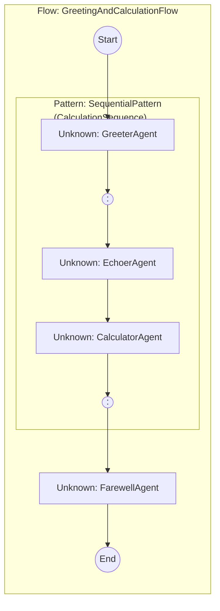

```mermaid
graph TD
subgraph GreetingAndCalculationFlow_overall ["Flow: GreetingAndCalculationFlow"]
    direction TD
    GreetingAndCalculationFlow_FlowStart(("Start"))
    GreetingAndCalculationFlow_FlowEnd(("End"))
    GreetingAndCalculationFlow_GreeterAgent_0["Unknown: GreeterAgent"]
    GreetingAndCalculationFlow_FlowStart --> GreetingAndCalculationFlow_GreeterAgent_0
    subgraph GreetingAndCalculationFlow_SequentialPattern_CalculationSequence_1_sub ["Pattern: SequentialPattern\n(CalculationSequence)"]
        direction LR
        GreetingAndCalculationFlow_SequentialPattern_CalculationSequence_1_start((:))
        GreetingAndCalculationFlow_SequentialPattern_CalculationSequence_1_end((:))
    GreetingAndCalculationFlow_GreeterAgent_0 --> GreetingAndCalculationFlow_SequentialPattern_CalculationSequence_1_start
    GreetingAndCalculationFlow_SequentialPattern_CalculationSequence_1_EchoerAgent_2["Unknown: EchoerAgent"]
    GreetingAndCalculationFlow_SequentialPattern_CalculationSequence_1_start --> GreetingAndCalculationFlow_SequentialPattern_CalculationSequence_1_EchoerAgent_2
    GreetingAndCalculationFlow_SequentialPattern_CalculationSequence_1_CalculatorAgent_3["Unknown: CalculatorAgent"]
    GreetingAndCalculationFlow_SequentialPattern_CalculationSequence_1_EchoerAgent_2 --> GreetingAndCalculationFlow_SequentialPattern_CalculationSequence_1_CalculatorAgent_3
        GreetingAndCalculationFlow_SequentialPattern_CalculationSequence_1_CalculatorAgent_3 --> GreetingAndCalculationFlow_SequentialPattern_CalculationSequence_1_end
    end
    GreetingAndCalculationFlow_FarewellAgent_4["Unknown: FarewellAgent"]
    GreetingAndCalculationFlow_SequentialPattern_CalculationSequence_1_end --> GreetingAndCalculationFlow_FarewellAgent_4
    GreetingAndCalculationFlow_FarewellAgent_4 --> GreetingAndCalculationFlow_FlowEnd
end
```